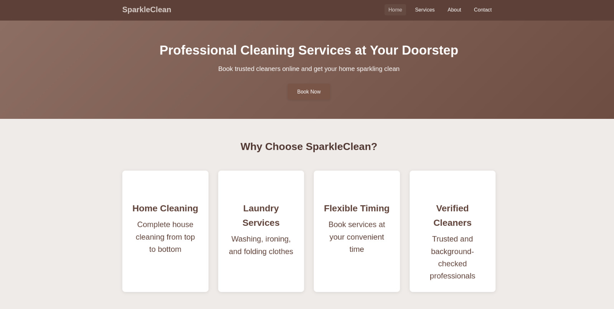
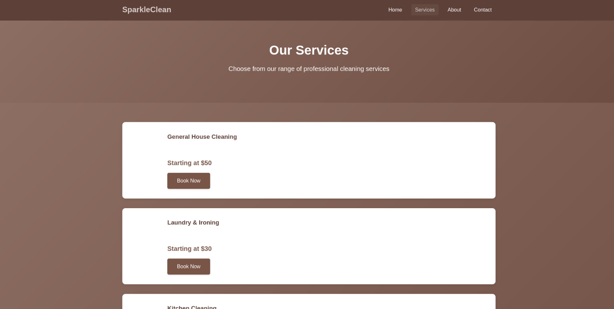
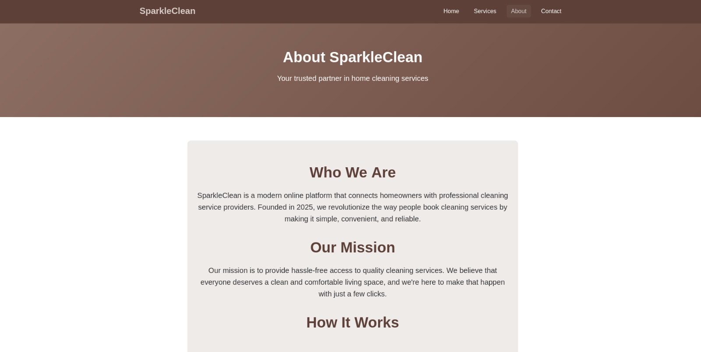
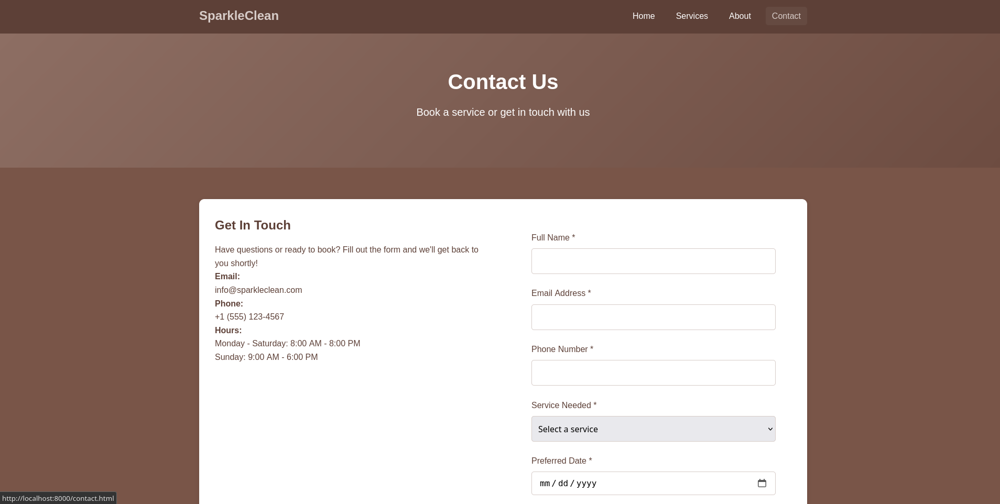

# SparkleClean - Online Cleaning Services Website

A simple, professional website for an online cleaning services business built with pure HTML and CSS.

## Team Members

- Alex Mwangi — [GitHub](https://github.com/Aleckqhie)
- Anthony Chege — [GitHub](https://github.com/tonilency)
- Samson Mwaurah — [GitHub](https://github.com/Mwaurahh)
- Alvin Mugo — [GitHub](https://github.com/Tamperke42)
- Mike Moreti — [GitHub](https://github.com/garisonmike)

## Overview

SparkleClean is an online platform that connects homeowners with professional cleaning service providers. Customers can browse services, learn about the company, and book cleaning services through a simple contact form.

## Technologies Used

- **HTML5** - Structure and content
- **CSS3** - Styling and responsive design

## Project Structure

```
cleaning_services_business/
├── index.html          # Home page
├── services.html       # Services listing page
├── about.html          # About us page
├── contact.html        # Contact/Booking form page
├── styles.css          # Single stylesheet for all pages
├── README.md           # Project readme
└── DOCUMENTATION.md    # Presentation guide
```

## How to Run

### Method 1: Direct File Opening
Simply open `index.html` in your web browser.

### Method 2: Using Python Server
```bash
python3 -m http.server 8000
```
Then visit: http://localhost:8000

### Method 3: VS Code Live Server
1. Install "Live Server" extension in VS Code
2. Right-click on `index.html`
3. Select "Open with Live Server"

## Features

- 4 interconnected pages
- 6 different cleaning services with pricing
- Contact form with HTML5 validation
- Responsive design for mobile and desktop
- Professional brown and white color scheme





